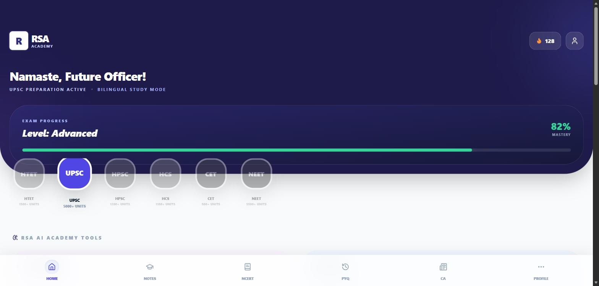

# 🎓 RSA Academy — رياض الصالحين

منصة تعليمية متكاملة (Next.js + Supabase) لإدارة سنترات ومراكز التقوية: متابعة الطلاب والمعلمين وأولياء الأمور من مكان واحد، بأربع بوابات دخول منفصلة حسب الدور.

## لقطة من المنصة وهي شغالة (النسخة المنشورة على الإنترنت)



## المميزات

- **أربع بوابات حسب الدور**: أدمن، معلم (Teacher)، ولي أمر (Parent)، وطالب (Student)، كل واحدة بصلاحياتها وواجهتها الخاصة.
- **لوحة تحكم الأدمن**: إدارة الطلاب، المعلمين، أولياء الأمور، الفصول (Classes)، المواد الدراسية، الإعلانات، والتقارير، مع سجل أمان (Security Logs) لتتبع العمليات الحساسة.
- **درجات وامتحانات لحظية**: تحديث الدرجات يوصل للطالب/ولي الأمر بدون ما يعمل Refresh للصفحة.
- **ربط الطالب بولي الأمر** ومتابعة أكتر من طالب من حساب واحد.
- **دفتر درجات للمعلم (Gradebook)** لكل فصل يدرّسه.
- **إشعارات وتذكيرات مجدولة** (Cron Jobs) للمدفوعات والحضور.
- **مصادقة ثنائية (2FA)** وتسجيل دخول آمن عبر Supabase Auth.
- واجهة عربية بالكامل (RTL) بخط Cairo.

## لقطة الشاشة

اللقطة أعلاه من الرابط الفعلي اللي المشروع منشور عليه: **https://rsa-academy.vercel.app**

## التقنيات المستخدمة

- **Next.js 16** (App Router) + **React 19** + **TypeScript**
- **Supabase** (قاعدة بيانات + مصادقة)
- **Tailwind CSS 4** + shadcn/ui
- **React Hook Form** + **Zod** للتحقق من صحة البيانات
- **Resend** للإيميلات، **Google Drive API** للتخزين، **Upstash Redis** للـ Rate Limiting

## طريقة التشغيل محليًا

```bash
npm install
cp .env.example .env.local   # وحطّ فيه بيانات Supabase وباقي المفاتيح (راجع CREDENTIALS_GUIDE.md)
npm run dev
```

المشروع هيفتح على `http://localhost:3000`.

## البناء للإنتاج

```bash
npm run build
npm run start
```

## مستندات إضافية

الريبو فيه توثيق تفصيلي جاهز:

- `MASTER_README.md` / `RSA_ACADEMY_COMPLETE_BLUEPRINT_FINAL_V2.md` — الخطة الكاملة للمشروع
- `CREDENTIALS_GUIDE.md` — إزاي تجيب كل الـ API Keys المطلوبة
- `TECHNICAL_DECISIONS.md` — القرارات التقنية وأسبابها
- `STUDENT_SUBJECTS_SYSTEM_DOCUMENTATION.md` / `TEACHER_PAYMENT_SYSTEM.md` — توثيق أنظمة فرعية داخل المنصة
